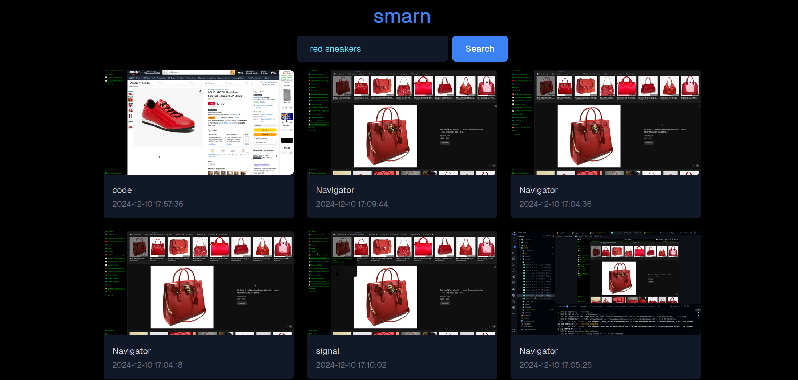

# smarn

smarn is a local, open-source AI-powered feature for Linux that captures and stores screenshots of your activities every few seconds, allowing you to search for records of past activity using natural language.

## Intentions

smarn is designed as a Linux-exclusive counterpart to Windows Recall (although this is not the sole identity of this piece of software).
We want to give Linux users a flavour of convenience without having to supply telemetry and surveillance data.

## What does it use?

- The `transformers` library; more specifically the jinaai/jina-clip-v1 model - for text and image-embedding. ([transformers](https://github.com/huggingface/transformers))
- Two FastAPI services that provide functions corresponding to text and image embeddings, searching using the said embeddings, and exposing screenshots to the interface. ([FastAPI](https://github.com/fastapi/fastapi))
- An `sqlite-vec` database to store embeddings and image-paths as well as to search for them. ([sqlite-vec](https://github.com/asg017/sqlite-vec))
- Asynchronus running of services to ensure maximum concurrency and non-blocking operations.
- An intelligent, self-rate-controlling mechanism that reduces/increases the rate of screenshot captures based on similarity of the previous and current screenshots (hence reducing compute and wastage of storage space).

## Why you need smarn

Forgot which website you saw those amazing shoes on? Know the description of a guy in a YouTube video you watched, but forgot everything else about the video? Ever wished for a personal archive of your on-screen activities that you could search as easily as Googling something? Here's why **smarn** is the answer:

1. **Never Lose Track of What You Saw**  
   Forgot which website had that perfect pair of shoes? smarn can help you recall it by searching with a description like _"red sneakers website."_

2. **Search Screenshots with Natural Language**  
   Want to find a YouTube video you were watching but only remember a vague description like _"a guy explaining quantum mechanics"?_ smarn can locate the relevant screenshots for you.

3. **Privacy-Friendly**  
   Unlike proprietary tools that siphon your data, smarn is open-source and Linux-exclusive, ensuring your activity stays local and secure.

4. **Storage Optimization**  
   By analyzing the similarity of successive screenshots, smarn adjusts its capture frequency dynamically, conserving storage space and compute power.
